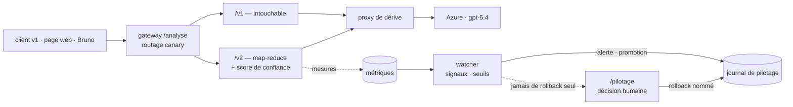

# Mardik v2 — analyse de contrats longs, livrée et pilotée par une chaîne LLMOps

[](https://github.com/Ganda15/mardik-api-mlops_v2/actions/workflows/llmops.yml)

Mardik lit un contrat commercial et en liste les clauses. La **v1** tronquait les contrats longs sans le dire et
ne donnait aucun indice de fiabilité. La **v2** analyse le contrat entier, rend un **score de confiance** et un
extrait littéral par clause — et chaque version est **livrée par la chaîne, jamais à la main** : testée, étiquetée,
déployée en canary, observée, promue ou retirée sur signal.

> Projet réalisé seul, brief « Mardik — La nouvelle version » (RNCP 37827, Développeur IA), septembre 2026.
> L'énoncé d'origine du dépôt est conservé dans [`docs/enonce-depot-initial.md`](docs/enonce-depot-initial.md).

---

## Les trois exigences du CTO, et ce qui les prouve

| Exigence (note « Plus jamais ça ») | Ce qui la prouve |
|---|---|
| **La v2 répond au besoin** — contrats longs, score de confiance, dans les contraintes | rappel **1,000** sur les 12 contrats de référence, précision **0,96 – 0,99**, P95 **4,4 – 7,6 s** (cible < 8 s), coût **0,033 €** par analyse (cible < 0,15 €) — gate sur le vrai modèle |
| **La v1 ne casse jamais** | `app/api_v1.py` non modifié ; `scripts/client_v1.py` vérifié par un test d'acceptance à chaque fusion ; un test garantit que la réponse v1 ne gagne aucun champ |
| **Chaque livraison est automatique, testée, réversible** | toutes les releases depuis `v2.0.0` publiées par la chaîne, aucune à la main ; un gate en échec a **réellement bloqué** une livraison ; retour arrière en un clic nommé ou par un workflow |

## Résultats mesurés

| | Résultat | Où le vérifier |
|---|---|---|
| Tests d'acceptance fournis par le brief | **10 / 10** | `pytest tests/acceptance -v` |
| Suite complète | **210 tests**, 33 fichiers | `pytest -q` |
| Couverture | **86,7 %** — la chaîne échoue sous 80 % | job `tests` de `llmops.yml` |
| Contrat de 40 pages (c12), requête réelle | **2,8 – 4,2 s** (11,5 s avant correction) | [`docs/exploitation.md` §9](docs/exploitation.md) |
| Coût par analyse | **0,033 €** moyen, 0,088 € pour c12 — tarifs entrée/sortie du modèle | [`docs/exploitation.md` §12](docs/exploitation.md) |
| Les trois boucles de rétroaction | démontrées **en réel** : rollback sur dérive, promotion canary, enrichissement du jeu d'évaluation | [`docs/exploitation.md` §9](docs/exploitation.md) |

---

## Architecture



**La v2, en une phrase** : le contrat est découpé en sections (regroupées jusqu'à 4 000 caractères), chaque
section est analysée en parallèle par le modèle, les clauses sont fusionnées puis notées — l'extrait cité doit
exister mot pour mot dans le contrat, sinon le score de la clause tombe à 0.

| Route | Rôle |
|---|---|
| `POST /v1/analyse` | l'API historique, inchangée |
| `POST /v2/analyse` | contrat entier → clauses, extraits, `confiance_globale`, `libelle` (haute / moyenne / basse), `request_id` ; erreurs explicites `422` (requête invalide) et `503` (fournisseur indisponible, avec `request_id`) |
| `POST /analyse` | la gateway : route vers v1 ou la version canary, en-tête `X-Mardik-Version` |
| `GET /gateway/etat` | quelle version sert quel trafic, et d'où vient le pourcentage |
| `GET /pilotage`, `/pilotage/etat`, `/pilotage/journal` | la page de pilotage : signaux par version, alertes, journal |
| `POST /pilotage/rollback` | retour arrière — jeton d'administration **et** nom obligatoires |
| `GET /` | la page d'analyse pour le client |

## La chaîne de livraison

[`.github/workflows/llmops.yml`](.github/workflows/llmops.yml), à chaque pull request et à chaque fusion sur `main` :

```
lint → tests (données · intégration · acceptance · couverture ≥ 80 %) → gate d'évaluation + rejeu des cas de production
     → build image (GHCR) → publication (tag vX.Y.Z + manifeste) → déploiement canary 10 %
```

- **Gate bloquant** : rappel, latence P95, coût — seuils dans un seul fichier versionné,
  [`eval/thresholds.yml`](eval/thresholds.yml). Un gate en échec arrête tout ce qui suit.
- **Le vrai modèle** : la CI tourne en simulation (gratuite) ; [`gate-reel.yml`](.github/workflows/gate-reel.yml)
  joue le gate sur Azure et pose un tag `eval-ok/<commit>`. La publication **refuse** un commit sans ce tag.
- **Artefact étiqueté** : image `ghcr.io/ganda15/mardik-api-mlops_v2:<version>` + manifeste (commit, empreinte du
  bundle, modèle, note, signature de la version saine).
- **Retour arrière par la chaîne** : [`rollback.yml`](.github/workflows/rollback.yml), déclenchement manuel, acteur obligatoire.
- **`main` protégée** : pull request obligatoire, checks `lint` / `tests` / `gate-evaluation` exigés, branche à jour.

## Observabilité et pilotage

- **Cinq signaux par version** : latence P95, coût moyen, taux d'erreur, **distribution** du score (part < 0,5 et
  médiane — la moyenne cacherait la dérive), part de trafic. Sous 30 requêtes : « données insuffisantes », aucune décision.
- **Le watcher** alerte sur dérive et promeut le canary (10 → 50 → 100 %) quand **tous** les critères tiennent ;
  il ne retire jamais une version seul — la décision de rollback est humaine, nommée, et reliée à l'alerte.
- **Enrichissement** : un cas réel à faible confiance est capturé, masqué (parties, montants, courriels),
  étiqueté, versé dans `eval/attendus_production.jsonl` — la chaîne le rejoue à la fusion suivante.
- **Ajustement des seuils** : procédure outillée, chaque changement tracé au journal avec son commit et son motif.
- **Traces** OpenTelemetry (OTLP, à visualiser dans Jaeger lancé à part), tableau de bord HTML (`:8501`), page de pilotage.

---

## Démarrer

Prérequis : Docker, [uv](https://docs.astral.sh/uv/), une ressource Azure OpenAI (ou Ollama en local).

```bash
uv sync
cp .env.example .env            # LLM_PROVIDER, LLM_MODEL, AZURE_AI_ENDPOINT, AZURE_AI_API_KEY
uv run python -m scripts.demo up
```

`scripts.demo` lance l'application (`:8000`), le proxy de dérive (`:8080`), le tableau de bord (`:8501`) et le
watcher, avec des seuils de démonstration (temps d'attente raccourcis, **jamais** un seuil de qualité — un test le
garantit). `scripts.demo public` ajoute une instance verrouillée par code d'accès et un tunnel ; `scripts.demo down` arrête tout.

```bash
uv run pytest -q                            # la suite, sans appel au modèle
uv run python -m eval.run_eval --version v2 --essais 1   # le gate sur le vrai modèle (~0,25 €)
```

### La démo en cinq minutes

| Étape | Commande ou lieu |
|---|---|
| v1 intacte, v2 sur un contrat long | page `http://localhost:8000/`, ou la collection [`bruno/`](bruno/) (10 requêtes, chacune documentée) |
| publier puis déployer un canary | `MOCK=on uv run python -m ops.deploy publier v2.0.0 --bundle v2` (gate simulé, gratuit), puis `uv run python -m ops.deploy canary v2.0.0 --pourcentage 50` |
| injecter une dérive réelle | `uv run python scripts/traffic_sim.py --mode derive-score --duree 90 --rps 1` |
| voir l'alerte, décider | `http://localhost:8000/pilotage` — le watcher alerte, un humain clique |
| lire la trace des décisions | `http://localhost:8000/pilotage` → journal, ou `GET /pilotage/journal` |

## Le dépôt

```
app/        api_v1.py (intouchable) · api_v2.py · gateway.py · pilotage.py · securite.py · pipeline/ · static/
models/     v1/ (fourni) · v2/config.yaml — le bundle versionné : prompt, paramètres, tarifs, seuils de libellé
eval/       run_eval.py (gate) · thresholds.yml · attendus.jsonl (12 contrats) · attendus_production.jsonl · contrats/
ops/        deploy.py · watcher.py · signaux.py · enrichissement.py · ajuster_seuils.py · detecteur.py · dashboard.py · registry/
scripts/    demo.py · client_v1.py · client_v2.py · traffic_sim.py
bruno/      la collection de démonstration
tests/      acceptance/ (les 10 du brief) · integration/ · un fichier par brique
.github/    workflows/ llmops.yml · gate-reel.yml · rollback.yml
```

## Documentation

| Document | Contenu |
|---|---|
| [`docs/besoin_client.md`](docs/besoin_client.md) | le besoin du client (fourni) |
| [`docs/spec-v2-perimetre.md`](docs/spec-v2-perimetre.md) | Chantier 1 : périmètre, contrat d'API, critères d'acceptation, divergences avec la conception |
| [`docs/spec-ch2-pilotage.md`](docs/spec-ch2-pilotage.md) | Chantier 2 : signaux, seuils, boucles, ordre des briques, divergences |
| [`docs/exploitation.md`](docs/exploitation.md) | le runbook : versions, chaîne, déploiement, rollback, preuves réelles, coût |
| [`docs/qualite-c12-c13.md`](docs/qualite-c12-c13.md) | couverture de tests et test des données |

## Limites, dites telles quelles

- Le **score de confiance** est l'auto-évaluation du modèle, pénalisée si l'extrait n'est pas dans le texte — il
  n'est **pas calibré** statistiquement.
- Le **coût** est calculé aux tarifs catalogue du modèle (entrée / sortie) ; la facture Azure réelle reste à rapprocher.
- La **latence** dépend de la file du fournisseur : sur neuf passages du gate réel sur GitHub, un a dépassé 8 s (12,5 s) — le gate l'a bloqué.
- **Pas de plafond de taille** sur `/v2` : un document démesuré est découpé en centaines d'appels, le fournisseur les
  limite (`429`) et l'API répond `503` explicitement — mais après avoir payé la première vague. Le refus en amont
  (`413` au-delà d'un plafond), prévu à la conception, n'est pas construit.
- Le **masquage** des cas de production est partiel par construction (une regex ne voit pas un nom sans forme
  juridique) : l'anonymisation avec le client reste ouverte.
- Le **lien public** passe par un tunnel éphémère : c'est une démonstration, pas un hébergement.
